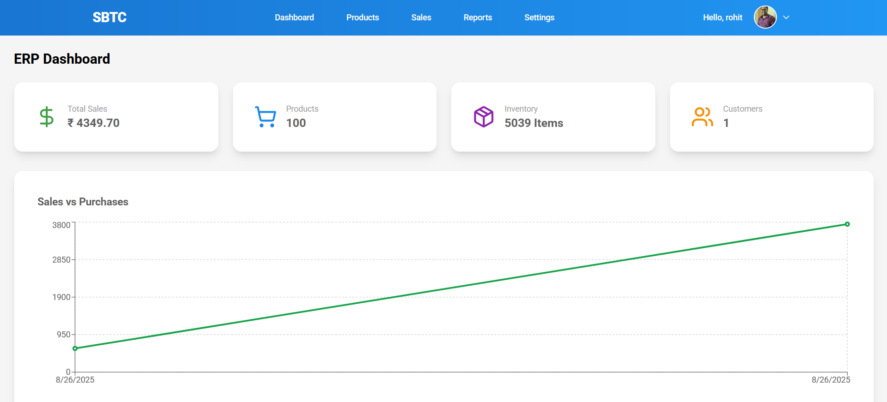

# ERP Inventory & Sales Management System

A complete **ERP Inventory & Sales Management System** built with **Django + Django REST Framework**.  
This project is designed to help businesses manage **Products, Customers, Sales, and User Roles (Admin, Manager, Staff)** efficiently with authentication powered by **JWT tokens**.

---

## ✨ Features

- 🔐 **User Management (Authentication & Roles)**  
  - JWT Authentication (Register, Login, Logout)  
  - Role-based Access Control (Admin, Manager, Staff)  

- 📦 **Product Management**  
  - Add, Update, Delete, and List Products  
  - Track product stock  

- 👥 **Customer Management**  
  - Store and manage customer details  
  - Name, Email, Phone  

- 💰 **Sales Management**  
  - Record sales with product, quantity, and total price  
  - Auto stock deduction on sales  
  - Sales history with dates  

- 🛠️ **API Endpoints (CRUD)**  
  - Fully RESTful APIs for **Products, Customers, Sales**  

---

## 📸 Screenshots

👉 Add screenshots of your project here. Example:

- **Admin Dashboard**  
  

- **Product List**  
  

- **Sales API Example**  
  


## 📜 License
This project is licensed under the MIT License – see the [LICENSE](./LICENSE) file for details.


---

## ⚙️ Installation & Setup

Follow the steps below to run this project locally:

```bash
# Clone the repository
git clone https://github.com/rahul9561/ERP-Inventory-Sales-Management-System.git

# Navigate into the project
cd ERP-Inventory-Sales-Management-System

# Create virtual environment
python -m venv venv

# Activate virtual environment
# On Windows:
venv\Scripts\activate
# On Mac/Linux:
source venv/bin/activate

# Install dependencies
pip install -r requirements.txt

# Run migrations
python manage.py makemigrations
python manage.py migrate

# Create superuser
python manage.py createsuperuser

# Run server
python manage.py runserver
```
Now open http://127.0.0.1:8000/  in your browser 🚀
